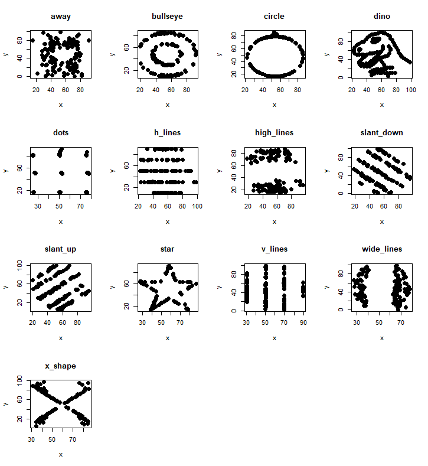
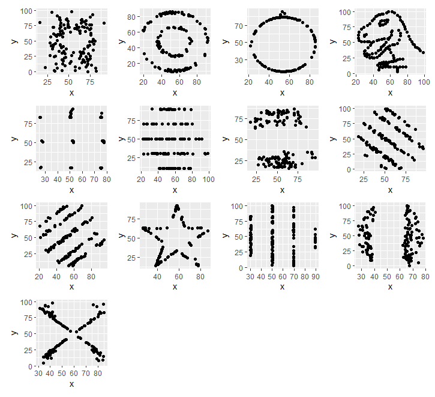

## Test yourself SOLUTIONS 
1. Download and load the file "R_datafun.Rdata" into your environment.
```
load("R_datafun.Rdata")
```

2. Plot the 13 sets within the datasaurus object.

 - Base R approach
   
```
## Read in the data if you do not have it already 
datasaurus <- read.delim(file="DatasaurusDozen.txt", sep="\t")

## Get all the dataset labels 
datasets = levels(factor(datasaurus$dataset)) 

## Set up your plot to have 4 by 4 graphs  
par(mfrow=c(4,4))

## Go through the datasets 
for( i in datasets) {
    ## Filter data using the dataset name, and selecting the 2nd and 3rd columns. 
    data_filt <- datasaurus[datasaurus[,1] == i ,2:3]
    ## Plot the points using the point type "19" and size of the point at 1.5. Add the dataset name as the title with the "main" parameter 
    plot(data_filt, pch=19, cex=1.5, main=i)
} 
```



- Tidy R approach
  
```
library(patchwork)
library(tidyverse)
## Read in the data if you do not have it already 
datasaurus <- read.delim(file="DatasaurusDozen.txt", sep="\t")

## Get all the dataset labels 
datasets = levels(factor(datasaurus$dataset)) 

## We are going to go through each dataset, generate the plot, and add the plot through the patchwork function to our final plot.   
check = 0 ## iterator check

for(i in datasets){
  ## Filter the data to the dataset 
  data_filt <- datasaurus %>% filter(dataset==i)
  ## Pass along the data to the ggplot function, and plot the points
  g <- data_filt %>% ggplot(aes(x=x, y=y)) + geom_point()

  ## If this is the first dataset, then save it as plot_all
  if(check == 0) {
      plot_all = g;
      check = 1
  ## Otherwise, add it to the current plot_all. This is done through the patchwork/ggplot library functions. 
  }  else {
      plot_all =  plot_all + g
  }  
}

## Once you've gone through all the datasets, you can display the plot: 
plot_all
```




 
2. Calculate the mean and standard deviation of x and y, and then the pearson correlation between x and y. Record all these values.

- Method 1
  
```
## Intialise a list to store the results. Could also use a matrix or data.frame. 
stats_data = list()
for(i in datasets){
  ## For each dataset label, filter to get the x and y values.  
  g <- datasaurus %>% filter(dataset==i)
  ## Calculate the mean of the x and y values with the mean() function, standard deviation with the sd(), and then the correlation using cor() or cor.test(), and use "c" or "cbind" to join them together as a vector. Store that vector in the list with the dataset label as the index.  
  stats_data[[i]]=  cbind(i,mean(g$x), mean(g$y) , sd(g$x), sd(g$y), cor(g$x, g$y, method="pearson") ) 
}
## Convert the list into a matrix using the do.call and rbind functions. 
stats_data = do.call(rbind, stats_data)
colnames(stats_data) = c("Dataset", "Mean x", "Mean y", "SD x", "SD y", "Pearson correlation")
## Convert to data.frame
stats_data = as.data.frame(stats_data ) 
```


- Output will look like this:

```                                                                                                          
      Dataset           Mean x           Mean y             SD x             SD y Pearson correlation
1        away 54.2660997842049 47.8347206248841 16.7698249541574 26.9397434188834 -0.0641283521547448
2    bullseye 54.2687300223789 47.8308231552178 16.7692394934267 26.9357266898859 -0.0685863942579484
3      circle 54.2673197061739 47.8377172672183 16.7600126596722 26.9300360878303 -0.0683433564501203
4        dino 54.2632732394366 47.8322528169014 16.7651420391168 26.9354034869391 -0.0644718527009517
5        dots 54.2603034512176 47.8398292087556 16.7677354884326 26.9301915180855 -0.0603414419935386
6     h_lines 54.2614417835141 47.8302519136352 16.7658979040685 26.9398762200398 -0.0617148379566778
7  high_lines 54.2688052797415 47.8354502039366 16.7667040161692 26.9399979612129 -0.0685042205058669
8  slant_down 54.2678488233662 47.8358963305882 16.7667589474046 26.9361049316378 -0.0689797353606317
9    slant_up 54.2658817856021 47.8314956520244 16.7688526706285 26.9386080708922 -0.0686092064450221
10       star 54.2673411044951 47.8395452250979 16.7689592162765 26.9302746876485 -0.0629611002268231
11    v_lines 54.2699272310275 47.8369879881688 16.7699586113558 26.9376838069739 -0.0694455695981721
12 wide_lines  54.266916301257 47.8316019880062 16.7699996179673 26.9379019277152  -0.066575230199981
13    x_shape  54.260150334038 47.8397172791604 16.7699576958193  26.930001686981 -0.0655833373100655
```

- Method 2

```
## Convert the data into a list of datasets using the lapply function and the filter function  
split_data = lapply(datasets, function(i)  g <- datasaurus %>% filter(dataset==i)  )
## Use the sapply function across the list to calculate the mean, sd, etc. 
stats_data = sapply(split_data, function(gi) c(mean(gi$x), mean(gi$y) , sd(gi$x), sd(gi$y), cor(gi$x, gi$y, method="pearson")  ) )

## This time, the rows and columns are switched, so we can use the t() function to transform our matrix: 
colnames(stats_data) = datasets
rownames(stats_data) = c("Mean x", "Mean y", "SD x", "SD y", "Pearson correlation")
stats_data = t(stats_data) 
```

- The output looks like this:
  
```             Mean x   Mean y     SD x     SD y Pearson correlation
away       54.26610 47.83472 16.76982 26.93974         -0.06412835
bullseye   54.26873 47.83082 16.76924 26.93573         -0.06858639
circle     54.26732 47.83772 16.76001 26.93004         -0.06834336
dino       54.26327 47.83225 16.76514 26.93540         -0.06447185
dots       54.26030 47.83983 16.76774 26.93019         -0.06034144
h_lines    54.26144 47.83025 16.76590 26.93988         -0.06171484
high_lines 54.26881 47.83545 16.76670 26.94000         -0.06850422
slant_down 54.26785 47.83590 16.76676 26.93610         -0.06897974
slant_up   54.26588 47.83150 16.76885 26.93861         -0.06860921
star       54.26734 47.83955 16.76896 26.93027         -0.06296110
v_lines    54.26993 47.83699 16.76996 26.93768         -0.06944557
wide_lines 54.26692 47.83160 16.77000 26.93790         -0.06657523
x_shape    54.26015 47.83972 16.76996 26.93000         -0.06558334
``` 


 - Method 3

```
## Using tapply on each of the different data columns (x and y), using the dataset ID as to apply on  
stats_part1 = cbind(tapply(datasaurus$x, datasaurus$dataset, mean ),
                    tapply(datasaurus$y, datasaurus$dataset, mean ),
                    tapply(datasaurus$x, datasaurus$dataset, sd ),
                    tapply(datasaurus$y, datasaurus$dataset, sd ))

stats_part2  = sapply( datasets, function(i) cor(datasaurus[datasaurus$dataset==i,2:3])[1,2] ) 

## Because the results are shuffled across the datasets, we need to align them using match. This gives us the order of the second list compared to the first. Check what stats_part1 and stats_part2 look like before this next step. 
m = match(rownames(stats_part1), names(stats_part2))
stats_data = cbind(stats_part1, stats_part2[m] )
colnames(stats_data) = c("Mean x", "Mean y", "SD x", "SD y", "Pearson correlation")

## Or we could have matched it the other way:
m = match(names(stats_part2), rownames(stats_part1))
stats_data = cbind(stats_part1[m,], stats_part2 )
colnames(stats_data) = c("Mean x", "Mean y", "SD x", "SD y", "Pearson correlation")
```

- Now the output should be (note the order of the datasets):

```
             Mean x   Mean y     SD x     SD y Pearson correlation
dino       54.26327 47.83225 16.76514 26.93540         -0.06447185
away       54.26610 47.83472 16.76982 26.93974         -0.06412835
h_lines    54.26144 47.83025 16.76590 26.93988         -0.06171484
v_lines    54.26993 47.83699 16.76996 26.93768         -0.06944557
x_shape    54.26015 47.83972 16.76996 26.93000         -0.06558334
star       54.26734 47.83955 16.76896 26.93027         -0.06296110
high_lines 54.26881 47.83545 16.76670 26.94000         -0.06850422
dots       54.26030 47.83983 16.76774 26.93019         -0.06034144
circle     54.26732 47.83772 16.76001 26.93004         -0.06834336
bullseye   54.26873 47.83082 16.76924 26.93573         -0.06858639
slant_up   54.26588 47.83150 16.76885 26.93861         -0.06860921
slant_down 54.26785 47.83590 16.76676 26.93610         -0.06897974
wide_lines 54.26692 47.83160 16.77000 26.93790         -0.06657523
```

3. Why is it important to visualise your data?   
Despite greatly different datasets/values, the summary statistics are the same! 

4. "Knit" your R markdown file into an html page or a pdf.  
