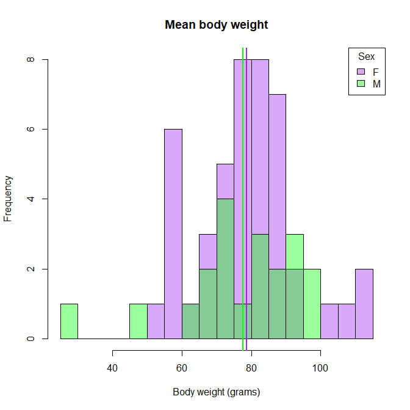
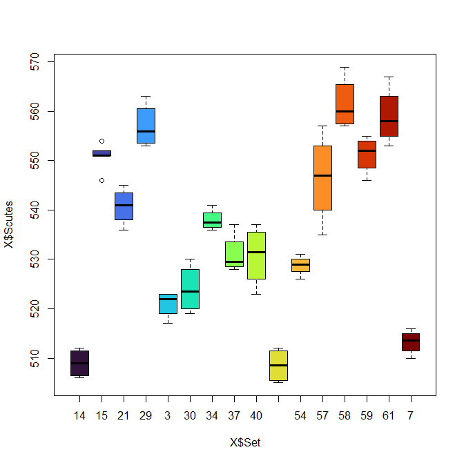
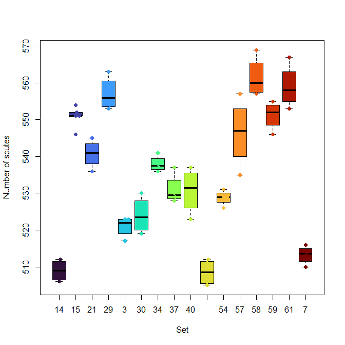
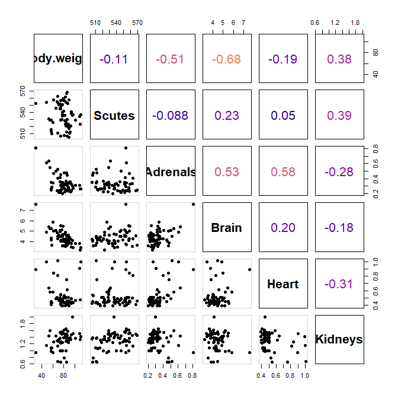
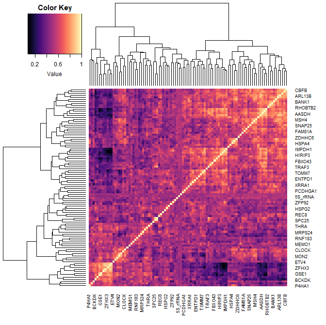
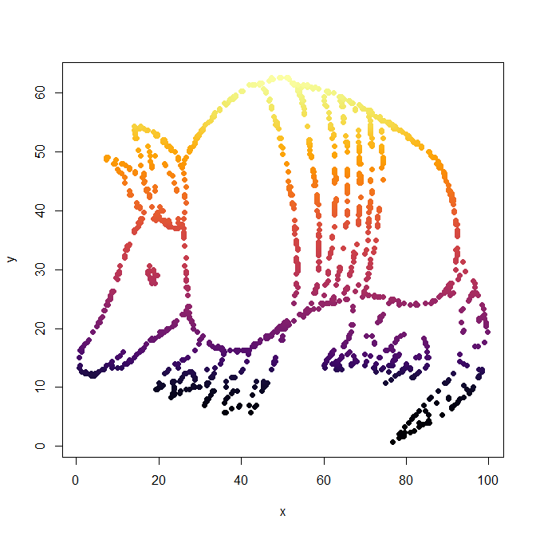
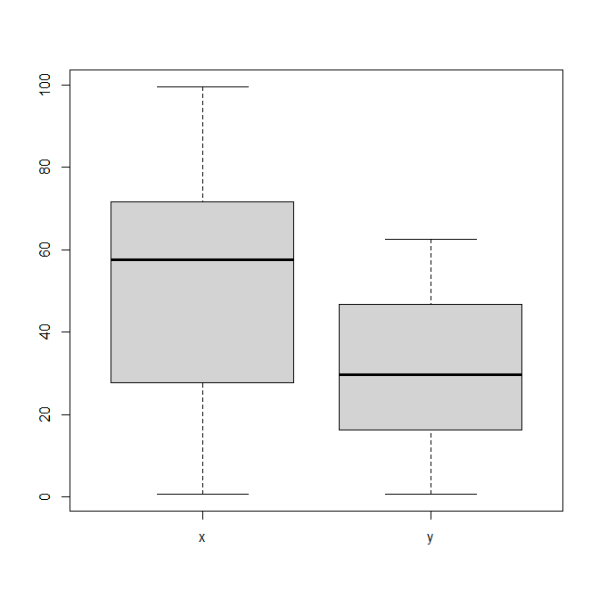
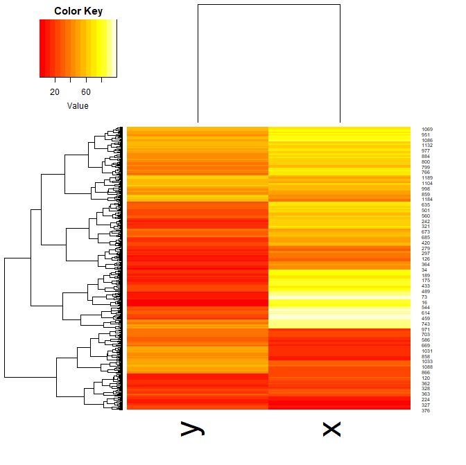

## Test yourself SOLUTIONS 
1. Download and load the file [R_dataviz.Rdata](../data/R_dataviz.Rdata)  into your environment.

```
load("R_dataviz.Rdata")
```

2. Plot three plots from the dataset "X" to answer the next set of questions. There are multiple columns in the dataset, so feel free to explore and play around first.
a. What are the average weights per sex? Show as a histogram.

```
female_mean = mean(X$Body.weight[X$Sex=="F"]) 
male_mean   = mean(X$Body.weight[X$Sex=="M"]) 
female_mean
male_mean

h = hist(X$Body.weight, breaks=20, plot=F) 
hist(X$Body.weight[X$Sex=="F"], breaks=h$breaks, col=makeTransparent("purple"), main="Mean body weight", xlab="Body weight (grams)")
hist(X$Body.weight[X$Sex=="M"], breaks=h$breaks, col=makeTransparent("green"), add=T)
abline(v= female_mean, col="purple", lwd=2)
abline(v= male_mean, col="green", lwd=2)
legend("topright", leg=c("F", "M"),  border=1, fill=makeTransparent( c("purple", "green")), title="Sex")
```




b. What are the range of scute numbers per set? Show as a boxplot.

```
# apply function
tapply(X$Scutes, X$Set, range)

# for loop with range 
for( set in levels(X$Set)){
  print(range(X$Scutes[X$Set==set]))
}

# for loop with summary 
for( set in levels(X$Set)){
  print(summary(X[X$Set==set,5])[c(1,6)])
}

n = length(levels(X$Set))
plot(X$Scutes ~ X$Set, col=turbo(n))
```




```
boxplot(X$Scutes ~ X$Set, col=turbo(n), xlab="Set", ylab="Number of scutes" )
beeswarm(X$Scutes ~ X$Set, pch=19, add=T, col=turbo(n))
```




```
beeswarm(X$Scutes ~ X$Set, pch=19, col=turbo(n), xlab="Set", ylab="Number of scutes" )
bxplot(X$Scutes ~ X$Set, add=T, col=makeTransparent(turbo(n)) ) 
```


c. What are the correlations between the biometrics? Show as a correlation plot. 

```
mat_cor = cor(X[,4:9])
mat_cor


## These functions are taken from the tutorial page
panel.hist <- function(x, ...)
{
    usr <- par("usr"); on.exit(par(usr))
    par(usr = c(usr[1:2], 0, 1.5) )
    h <- hist(x, plot = FALSE)
    breaks <- h$breaks; nB <- length(breaks)
    y <- h$counts; y <- y/max(y)
    rect(breaks[-nB], 0, breaks[-1], y, col = "purple", ...)
}
## with size proportional to the correlations.
panel.cor <- function(x, y, digits = 2, prefix = "", cex.cor, ...)
{
    usr <- par("usr"); on.exit(par(usr))
    par(usr = c(0, 1, 0, 1))
    r <- (cor(x, y))
    txt <- format(c(r, 0.123456789), digits = digits)[1]
    txt <- paste0(prefix, txt)
    if(missing(cex.cor)) cex.cor <- 0.8/strwidth(txt)
    text(0.5, 0.5, txt, cex = 2, col= plasma(100)[round(abs(r),2)*100])
    #text(0.5, 0.5, txt, cex = cex.cor * r, col= plasma(100)[round(r,2)*100])
} 


pairs(X[,4:9],  
      lower.panel = panel.pts, 
      upper.panel = panel.cor,  
      cex.labels = 2, 
      font.labels = 2,
      bg=1:3,
      pch=19)
```

 
 

3. Now, using the dataset "Y", plot a heatmap. Aim for clarity! 
``` 
heatmap.2(Y, col=magma(100), density="none", trace="none")
```


4. And finally, look at dataset "Z". Plot it the best way you think would show its key feature. 
``` 
plot(Z, pch=19, col=inferno(1204))
boxplot(Z)
heatmap.2(as.matrix(Z), density="none", trace="none")
```





5. "Knit" your R markdown file into an html page or a pdf.  


 

