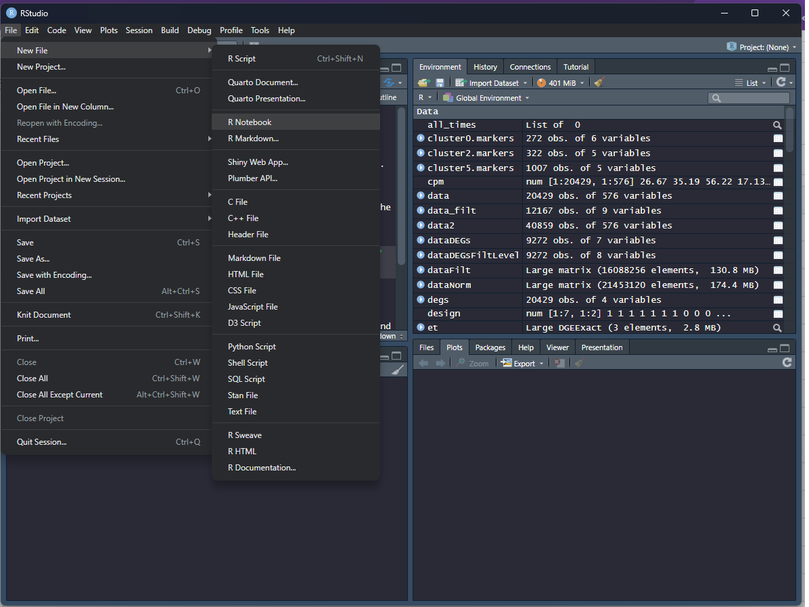
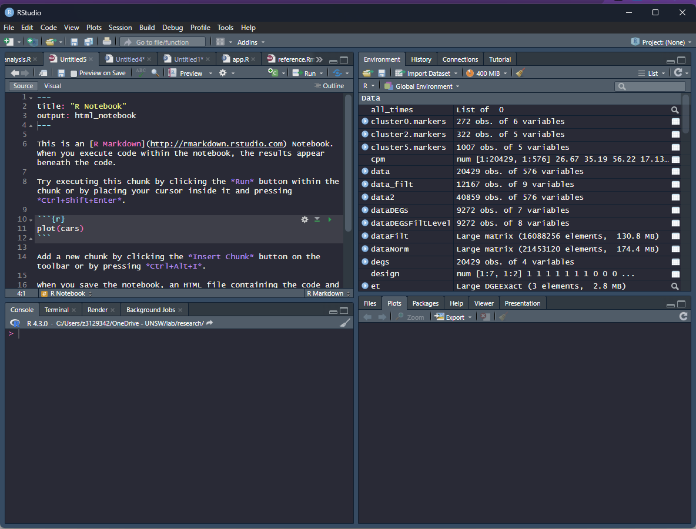
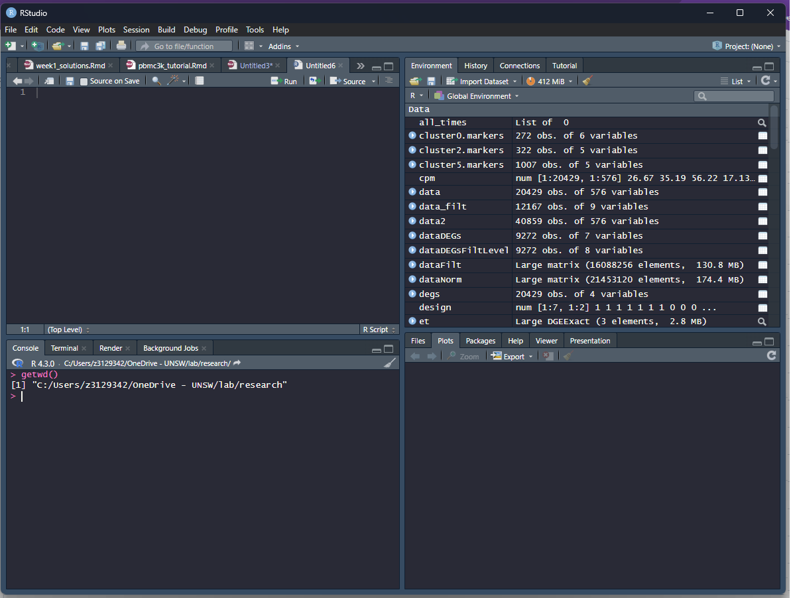

# Week 2: R basics
## Objectives
This tutorial will teach you background knowledge on R. 
You’ll learn about:
- objects
- R’s basic data types
- R’s basic data structures including vectors and lists
- functions and their arguments

## Downloads
First things first! Download these files into your working directory: 
- [data](../data/lesson1.Rdata)
- [helper.R](../data/helper.R)


## Setting up
Make sure you have installed Rstudio. 

Open up Rstudio.


You should be able to see 4 different windows. We will be working within the "Source" and "Console" windows. 

Start a new notebook file by selecting "File" -> "New File" -> "R Notebook" 


This should open up a file in the source window. Change the title to "Week 1", and include your name as the author by including this line underneath the title:


```
title: "Week 1" 
author: "Sara"
```

In the console window below the source window, check your working directory by typing in:

```
getwd()
```



To set your working directory: 
```
setwd("cloud/project")
```
Or 
```
setwd("X:/project")
```
Run this to install/load libraries (this might take a while if you do not have most of the packages installed, so run this as soon as possible). 
```
source("helper.R") 
```

### For each code chunk in the tutorial, test it in the console then copy it into your notebook as an R code chunk. This should run when you press play. 

## Defintions
- Variable: Holds a value 
- Function: Takes in input, does some magic/task, returns output
- Command: Code snippet you want to evaluate
- Environment: Your workspace, where your variables, functions and packages are stored 
- Object: variable, function, data etc. What fills up your environment

- Commands/functions in R are called like so: 
  
```  
print("Hello World")
```

- The print function is given an argument (also known as input) within the '()' . All functions are called this way

``` 
load("lesson1.Rdata")
sum(x)
plot(x,y)
require(limma)
source("helper.R")
```
- The output is returned once the function or command is evaluated - i.e. when you run it or enter into the command console 

Try it! 
  
## Simple arithmetic
- R is really a calculator
- Basic arithmetic operators do what you think they would: +, -, *, /
- Some special operators: %% (modulus), %*% (matrix multiplication) 
- Some special variables: pi, TRUE, FALSE, NULL, NA, NaN, Inf
- Some fancier operators:  log(), exp(), sqrt(), round()
- Some logical operators: |, &, <, > 
``` 
1 + 2
2/4
(4+5^7)/56
3 %% 5 
log10(100)
```
- Spaces do not matter
- Order of operations matters
- more here: https://www.statmethods.net/management/operators.html 

## Variables
- Variables are letters or words 
- Store a value 
- Could be a number, character, string, array (or vector), matrix, etc. 
- Assign a value to a variable either via the assignment operator <- or the equals sign = 
  
```
x <- 1
y = 2 
very_important_variable <- 0
not_very_important = 100 
``` 

- Can change existing variables, add, send them into commands/functions 
``` 
data <- 0 
data <- 3 
data <- x + y 
data <- sqrt(x)
data <- rnorm(1000)
more_data <- 1000
data <- data + more_data 
```


## Data types and structures
- Numbers (integers, doubles): 
``` 
1
1.32545
5e9
```
- Characters:
``` 
'A'
'z'
```
- Strings:
``` 
"Yaaaas"
"Booo"
"Whatever"
```
 
- Array or vector: made of multiple elements of the same data class
``` 
c(1,3,5)
c('A', 'B', 'C')
c("Hello", "Goodbye")
1:100
rnorm(100)
rep(1,10)
seq(0,200,10)
```
- Can assign them to variables 
```  
my_seq <- seq(0,200,10)
```
- Access elements by an index 
```  
my_seq[1] 
```
- and replace or change single or multiple elements 
```   
my_seq[1] <- 1000 
my_seq[3:6] <- c(30,20,40,36) 
```
NOTE: in R, we count from 1 (not 0)

- Matrix or tables: 
```
diag(10)
matrix(1:10, ncol=5, nrow=2)
cbind(1:10, 10:1)
rbind(1:10, 10:1)
```

- Can also access elements via indices, but this time we select the row, then column:
``` 
A <- diag(5)
A[1,5] <- 9
A
```

- Negative indexing returns all but the indices specified, useful for data splicing.  
``` 
my_seq <- seq(0,200,10)
my_seq[-10]
my_seq[-10:-20]
```

- Lists are collections of data, and elements in a list can be of varying lengths and data classes/types. 
``` 
B <- 1:10
C <- sex
D <- list(A,B,C)
```

- Access different levels with double square brackets
``` 
D[[1]]
```

- or, if we have tags/labels/names on the elements within the list, via the tag operator `$`
```  
names(D) <- c("A", "B", "C")
D$A
D[["A"]]
```
- We can have an almost infinite number of nested lists (but this is dangerous/mad/confusing/useful)
- We can add elements to a list by assigning a position/index to a value. 
``` 
D[[4]] <- D 
D[[4]][[4]] <- D 
D[[4]][[4]][[3]]
```
- Can delete a component by assigning NULL to it. 
``` 
D[[1]] <- NULL
```
- We can append two lists
``` 
my_list = list("a", "b", "c")
your_list = list("x", "y","z")
append(my_list, your_list)
```

- But, lists themselves need to be specified/initialised beforehand 
``` 
E <- list()
```


### Advanced data types and structures

- Factors: define your own data class and has levels or strict values that this new data class can take.
``` 
sex <-  c("male", "female", "male", "male", "female")  
sex <- factor( sex, levels=c("male", "female"))
sex
```

- If you try to assign a new value to a variable, it has be one of the known levels, otherwise goes to NA. 

``` 
sex[1] <- "female"
sex[2] <- "unknown" # This will cause an error!
sex # You should see the NA value 
```
- Data frames also combine multiple data types, but as a table (or matrix) 
``` 
data.frame( x=1:10, y = rep("hello", 10) ) 
```
- They also work in a similar way to the matrix class, but have stricter rules for row.names, and are much easier to mess up.
- Updated versions of data.frame include tibbles, but this belongs to the "tidyverse". We will come back to this later.

### Advanced R types 
As R is an object-oriented (OO) language, there are also some OO systems (which we will not go through here). The most commonly used in bioinformatics related packages is the S4 class. For some advanced reading: http://adv-r.had.co.nz/S4.html. 

## Functions
- Functions take in inputs or arguments
- User defined or from other packages 
- Every function has its own set of inputs
- They have to be entered into the function in the correct order, or labelled 
- You can find out the necessary input from the man page of a function 
``` 
?order
```
- Or by typing in the name of the function into the console
``` 
order
```

Some useful functions:
``` 
length(my_list) # returns the length of an object 
sort(my_seq)   # sorts a list, vector or matrix  
ls()     # lists all the objects in your environment 
```

- More here: https://www.statmethods.net/management/functions.html 

### User-defined functions
- The structure of a function: 
```
my_function <- function(arg1, arg2, ... ){
  commands (or statements)
  return(object)
}
```
- objects in the function are local, so changing them within the function does not have a global effect (mostly, but beware!)
- objects returned can be any data type
- can look inside other functions to see how they work:
```
dist
```
- you can write your function for tasks that are usually repetitive or have some 'abstract' function
```
my_plot <- function(data){ 
 plot(data, pch=19, col="blue", cex=2)
}

my_plot(my_seq)
```


## Test yourself! 
1. Install these packages (and their dependencies): 
   +  From CRAN: [tidyverse](https://www.tidyverse.org/), [devtools](https://cran.r-project.org/web/packages/devtools/index.html)
   +  From bioconductor: [EGAD](https://bioconductor.org/packages/release/bioc/html/EGAD.html)
   +  From github: [CatterPlots](https://github.com/Gibbsdavidl/CatterPlots)
2. Create an R markdown file (using RStudio). Save the file as "yourname_Lesson1.Rmd". Delete the instructions starting from "This is an [R...". For the remaining questions below, insert the code as R chunks when you are satisified with your solutions. An R chunk is code placed  after a line that starts with ` ```{ r } `and ends before a line with ` ``` `.  
3. Generate a vector of random numbers (any which way you want) of length between 10 and 100, and assign it to a variable called "my_random_numbers". Print out the length of this vector, and then the first and last numbers of the vector. 
4. Generate two square matrices (equal width and height) named B1 and B2. Multiply these matrices and save the output of the multiplication as B. Print out the first column of B1, the last row of B2, and then the diagonal of B. 
5. Plot any of the plots from the CatterPlot page.
6. Make a matrix of dimension 20 by 40, full of zeroes. Then, modify the matrix so that once viewed, it spells out your initials OR a random shape OR pixel art. Use the [image()](https://www.rdocumentation.org/packages/graphics/versions/3.5.1/topics/image) function to view it as you go along, but remember, it plots things [rotated](https://www.r-bloggers.com/creating-an-image-of-a-matrix-in-r-using-image/)... Once done, plot it using the image function, but remove the axes. 
7. "Knit" your R markdown file into a pdf or html. 
 
Solutions: Next week!

## Resources and cheatsheets
https://posit.cloud/learn/cheat-sheets 
https://posit.cloud/learn/primers/1.2 

Back to the [homepage](../README.md)

