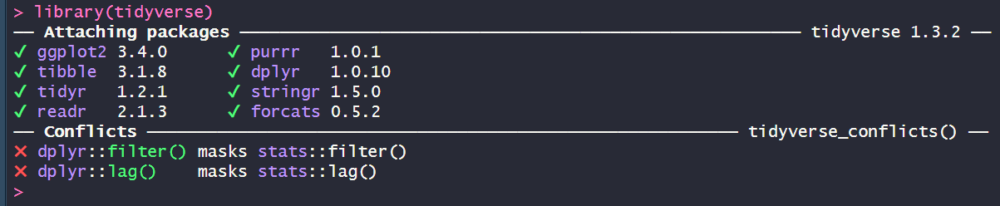

# Week 4: A fun(ctional) example
## Objectives 
Let's play with real data! Learn the most important data handling skills. In this tutorial: 
- Extracting values from a table
- Reading in data 
- Calculate summary statistics

## Downloads 
Download these files into your working directory: 
- [lesson3](../data/lesson3.Rdata) 
- [helper.R](../data/helper.R)
- [data](../data/my_data.zip)

Extract the data.zip folder.

####  
To check your working directory:
```
getwd()
```
To set your working diretory: 
```
setwd("X:/project")
```
Run this to install/load libraries
```
source("helper.R") 
```

## Reading in data
- Depending on the format, there are multiple ways to input data into R 
### From files
- From a comma or tab separated file:
```
dataA <- read.csv(file="my_dataA.csv")
dataB <- read.table(file="my_dataB.tab", header=TRUE)
datasaurus <- read.delim(file="DatasaurusDozen.txt", sep="\t")
```
- With more control:
  
```
scan()
readLines()
```
- From Excel 

```{r}
install.packages("xlsx") 
# This needs a few other packages, in particular rJava. If prompted, download the 64 bit version (for Windows) from: https://www.java.com/en/download/manual.jsp. 
# This might not be necessary,but in case
install.packages("rJava") 
Sys.setenv(JAVA_HOME='C:\\Program Files\\Java\\jre1.8.0_181') # depending where Java is installed 

library(xlsx) 
data <- read.xlsx(file="pnasEisen1998.xlsx", 2)
key <- read.xlsx(file="pnasEisen1998.xlsx", sheetName = "Key")
```

- From a PDF (a little more advanced)

```{r}
install.packages("pdftools")
library("pdftools")
library("glue")
library("tidyverse")

pdf_filename  <- "elife-27469-v1.pdf"
pdf_text_extract <- pdf_text(pdf_filename)
length(pdf_text_extract)
# load("lesson3.Rdata") # if the pdf extraction didn't work
```


- We can then extract the text from each page. Let's pick page 5, and extract the table that starts around line 5.
[!elife_table](../imgs/elife_table.png)
```{r}
page <- str_split(pdf_text_extract[[5]], "\n", simplify = TRUE) 
table <- unlist(page)[5:21]
```
- Each row of the table is one long string. To extract the columns, we can use a combination of substr(), trimws() and sapply().
- This is a little messy, but the as the data is not in an ideal format, we need to spotcheck and make sure we are extracting the correct text.
- For the first column, we take the first 80 characters with the *substr* function. We trim away all leading and trailing whitespace with *trimws*.
- We apply this function to all the rows in the table with *sapply*. 
```
mutation_types = sapply(1:length(table), function(i) trimws(substr( table[i], 1, 80)))
```
- Repeat for all the other columns
```
day1 = sapply(1:length(table), function(i) trimws( substr( table[i], 81, 90 )))
day8 = sapply(1:length(table), function(i) trimws(substr( table[i], 91, 105 )))
day15 = sapply(1:length(table), function(i) trimws(substr( table[i], 106, 120 )))
```
However, the last column has an extra character "\r" that we need to remove as well. We do with with the *gsub* function, which substitutes a regexp, string, with another (in this case we used an empty string).   
```
day8_15 = sapply(1:length(table), function(i) gsub("\r", "", trimws(substr( table[i], 121, 150 ))))
```
- We now have 5 columns, which we merge into a marix/table with *cbind*. The row equivalent is *rbind*.  
```
data_table = cbind(mutation_types, day1, day8, day15,day8_15)
```
- This table is messy as a matrix, as all the numbers are stored as strings, so let's build it in a more useful format like a data frame that can handle the different data types.
- We use the data.frame function, and assign each column a label and the data. Note, we are removing the first element/row through negative indexing. 
```
data_table_df = data.frame(mutation_types = mutation_types[-1], day1=day1[-1], day8=day8[-1], day15=day15[-1], day8_15=day8_15[-1])
```


### From other places, types  
- URLs: using RCurl, e.g., http://rfunction.com/archives/1672 
- SQL databases: using DBI, dblplyr, or plyr. e.g., SRADB https://www.rdocumentation.org/packages/SRAdb/versions/1.30.0/topics/getSRA 
- APIs: using httr, jsonlite, e.g., https://www.r-bloggers.com/accessing-apis-from-r-and-a-little-r-programming/ 


### Check data
It is always very important to check that you have correctly read in your data. Some basic data/sanity checks. 
- Does it looks like what you think it should? Did you read in the correct file? 
- Same number of lines imported as the file contains? 
- No weird characters? Some special characters have special properties when being read in. 
- Correct data type? If numbers are stored as characters, there may be something odd in your input. 
- Store data into different variables, into tables or into the tidyverse tibbles etc.
- Visualize/spot check.  

### Clean up data, or data "wrangling"
Data is never tidy. Data wrangling is the process of cleaning and structuring data to improve the data quality, remove inaccurate data, and ensure that the data is of good enough quality for your analysis.
- Data structuring: Adjust format to make it compatible with future use, and easier to work with. Spread/pivot tables, or gather. Add labels, and/or combine datasets. 
- Data cleaning: How many empty values? Find/replace empty values with NAs. If row or column has too many empty or invalid entries (~80% as a rough guide), remove or flag that column/row.
- Data validation: Verifying that your data is consistent and high quality. Quality control could be experiment/data dependent - e.g., removing doublets from single-cell data. Or could be a broader check on the distribution of the data. Low correlation to expected values, or too many outliers could be a sign of a poor quality dataset. Or it could be interesting!  

 
## Saving (or exporting) data
- As text 
```
write.table(my_list, file="my_list.txt", sep="\t", quote="", row.names=T)
write.csv(my_list, file="my_list.csv")
```
- As binary file
```
all_my_data <- rnorm(10000) 
my_function <- function(x){ 
  print("Hello, world!") 
}
save(all_my_data, my_function, file="my_data.Rdata")
```
### Saving graphics 
- As a pdf or postscript (vector graphics) 
```
pdf("my_plot.pdf") # or try postscript()  
plot(my_data)
dev.off() 
```
- Or as an image (.png, .jpeg)
```
png("my_plot.png") # or try # jpg() 
plot(my_data)
dev.off() 
```

## Tidy data 
Tidyverse packages are designed to work well together. 


### Tibbles
The basic data format for the tidyverse are "tibbles" (tidy tables). They work (and look) a little different to the basic R table, but can be manipulated with tidy based functions. 
R will print only the first ten rows of a tibble as well as all of the columns that fit into your console window. R also adds useful summary information about the tibble, such as the data types of each column and the size of the data set.
Note, when you do not have the tidyverse packages loaded, tibbles act as data.frames! 
```

```

- You can transform a data frame to a tibble with the as_tibble() function. 
```
x <- c("A", "B", "C", "D")
y <- 4:1
z <- c("How", "do", "you", "do?")
data_frame = data.frame(ID=x, num=y, words=z)
tibble_data = as_tibble(data_frame)
```

### Tidy functions 
- `select()` and `filter()`, which let you extract rows and columns from a data frame
- `arrange()`, which lets you reorder the rows in your data
```
select(tibble_data, ID, num)
filter(tibble_data, ID == "A")
arrange(tibble_data, num)
```

- `%>%,` which organizes your code into reader-friendly “pipes”
Another useful tidy functionality is the use of the pipe. This allows you to use the output of your last function into a new function, with no need to assign intermediate variables. Take for example the below steps: 
```
iris_tibble = as_tibble(iris)

iris_tibble_set <- filter(iris_tibble, Species == "setosa", Petal.Length > 1.6 )
iris_tibble_set <- select(iris_tibble_set, Sepal.Length, Sepal.Width)
iris_tibble_set <- arrange(iris_tibble_set, desc(Sepal.Width))
```
These could be combined:  
```
arrange(select(filter(iris_tibble, Species == "setosa", Petal.Length > 1.6), Sepal.Length, Sepal.Width), desc(Sepal.Width))
```
But this is a little hard to read. The pipe version "tidies" this to: 
```
iris_tibble %>% 
  filter(Species == "setosa", Petal.Length > 1.6 ) %>% 
  select(Sepal.Length, Sepal.Width) %>% 
  arrange(desc(Sepal.Width))
```
### Reshaping tidy data 
- `mutate()`, `group_by()`, and `summarize()`, which help you use your data to compute new variables and summary statistics
- `gather()` - which reshapes wide data into long data. Newer version is called `pivot_longer()`
- `spread()` - which reshapes long data into wide data. Newer version is called `pivot_wider()`


## Test yourself! 
1. Create an R markdown file (using RStudio). Save the file as "yourname_Lesson3.Rmd". Once again, delete the instructions starting from "This is an [R...". For the remaining exercises, insert the code as R chunks when you are satisified with your solutions. An R chunk is code placed  after a line that starts with ` ```{ r } `and ends before a line with ` ``` `.  
2. Load the file "lesson3.Rdata" into your environment. Check and tidy up the datasets.
3. Plot the 13 sets within the datasaurus object. Calculate the mean and standard deviation of x and y, and then the pearson correlation between x and y. Record all these values. Why is it important to visualise your data?   
4. "Knit" your R markdown file into an html page or a pdf.  
 
Solutions: Next week!

Back to the [homepage](../README.md)
