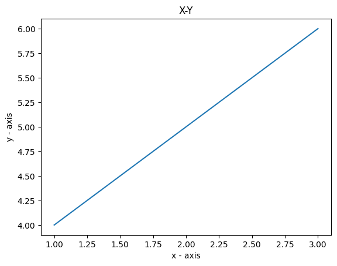
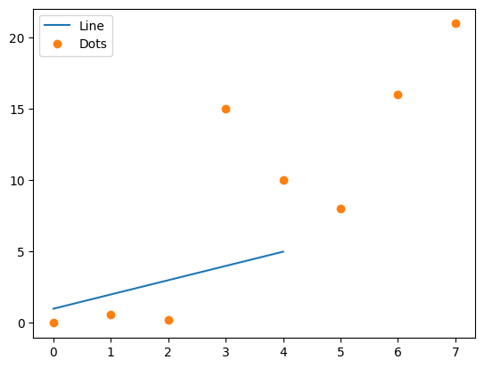
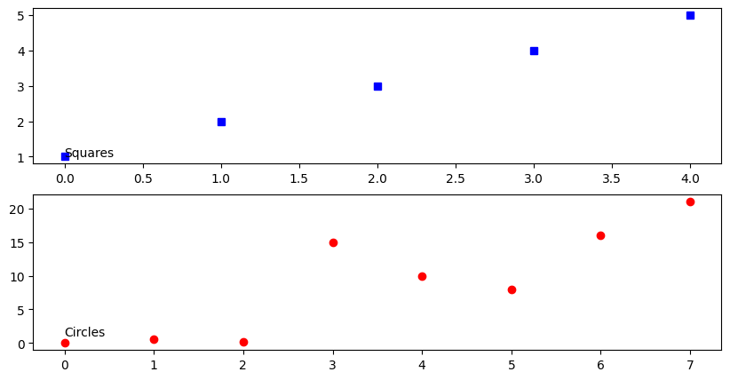

# Week 3: Data Viz
## Objectives 
- Plotting and displaying data in python
- Using numpy, pandas and seaborn libraries
  
## Downloads  
First things first! Download these palmer penguins data into your working directory. Note, you may need to use pip3. 
Into a terminal, type in: 
```
pip -q install palmerpenguins
```

### Installing and importing libraries 

Make sure you have these installed too. 
```
pip install numpy
pip install pandas
pip install seaborn
pip install palmerpenguins
```

## Setting up
Start a new notebook. Save the file as "yourname_week3.ipynb". 
As before, copy the code into your notebook as chunks. 

Then, run an interactive python session in a terminal. In your python session:
```
import numpy as np
import pandas as pd
import seaborn as sns
import matplotlib.pyplot as plt
```
- Pandas is a library for working with tabular data. Based on the R data.frame library.
- Seaborn is a visualization package.
- Palmerpenguins is a dataset used for data exploration & visualisation education. https://github.com/mcnakhaee/palmerpenguins 

### Importing data 
Let's first load the data we will be using.  
```
from palmerpenguins import load_penguins
df = load_penguins()
print(type(df))
df
```

### Summary statistics and properties 
- Since the dataset is in the form of a data frame, we can use `pandas` functions to play around with it. 
```
print(df.describe())
print(df.dtypes)
print(df.columns)
```

### Indexing/accessing data in a data frame 
- Using an index or the column name:  
```
print(df.values)
i=1
j=0
print(df.loc[i])
print(df.iloc[i,j])
print(df[['bill_length_mm','island']])
print(df.query("year > 2007"))
```

# Q1: Test yourself!
### In your jupyter notebook, create new chunk for this question. In this chunk, write some code to access and print out the properties of the first two _columns_ from the `df` variable. 


### Plotting 

Basic x-y plot:
```
# X values
x = [1,2,3]
# Y values
y = [4,5,6]
	
# Plotting the points
plt.plot(x, y)
	
# Naming the X and Y axes
plt.xlabel('x - axis')
plt.ylabel('y - axis')
	
# Adding a title
plt.title('X-Y')
	
# Showing the plot
plt.show()
```



You can also add points to the plot by specifiying the plot type. And if we don't give an x and y, the x is the "index". 
```
a = [1, 2, 3, 4, 5]
b = [0, 0.6, 0.2, 15, 10, 8, 16, 21]
plt.plot(a)
# o is for plotting a scatter plot (i.e., no connecting lines, just the dots)
plt.plot(b, "o")

# Get current axes and plot the legend
ax = plt.gca()
ax.legend(['Line', 'Dots'])

plt.show()
```



There are many more plotting features you can play with, including colors, figure size (figure()), text (annotate()) and multiple plots (subplot()). 
```
fig = plt.figure(figsize =(10, 5))
sub1 = plt.subplot(2, 1, 1) # two plots, or 2 rows, one column, position 1
sub2 = plt.subplot(2, 1, 2) # two plots, or 2 rows, one column, position 2
sub1.plot(a, 'sb') # squares, blue
sub1.annotate("Squares", (1,1))
sub2.plot(b, 'or') # circles, red
sub2.annotate("Circles", (1,1))
plt.show()
```


Read more here:
https://matplotlib.org/stable/gallery/lines_bars_and_markers/simple_plot.html
https://www.geeksforgeeks.org/simple-plot-in-python-using-matplotlib/


# Q2: Test yourself!
### In your jupyter notebook, create new chunk for this question. In this chunk, write some code to create two variables `m` and `n` that are correlated to each other. You can do this by first creating values for `m`. If you remember from last week, we generated a single value with the random package. Here, we can use the numpy package to generate multiple numbers. e.g., m = np.random.normal(0,1,100), where 0 is the mean, 1 is the standard deviation, and 100 is the number of values to generate. To get correlated values `n`, we generate some "noise" (e.g, `noise = np.random.normal(0,0.1,100)`) and add that signal to `m` (assigning it to `n`). Then plot `m` versus `n` variables (don't forget the "o" variable!). Note how we decreased the standard deviation when generating the noise signal. See what happens when you play around with that value by increasing and decreasing it and plotting those two graphs again. 


#### Penguin plots
We will use the seaborn module (which we named sns) to plot the palmer penguin data. First, let's take a look at the distribution of bill lengths. 
Here we use the histplot function, and add a density line. 
```
sns.histplot(df['bill_length_mm'],kde=True,bins=20)
```


Another plot type are "joint" or scatter plots with histograms. Here we can plot the bill length versus the bill depth, along with their distributions as histograms. 
```
sns.jointplot(data=df, x="bill_length_mm", y="bill_depth_mm") 
```


We can also plot all the different data, pairwise. Note, some of these plots look weird. 
```
sns.pairplot(df)
```


The seaborn package also lets us draw boxplots. Here we can split them by island and species. 
```
g = sns.boxplot(x = 'island',
            y ='body_mass_g',
            hue = 'species',
            data = df,
            palette=['#FF8C00','#159090','#A034F0'],
            linewidth=0.3)
g.set_xlabel('Island')
g.set_ylabel('Body Mass')
plt.show()
```


Plot the flipper length and add regression models per species:  
```
g = sns.lmplot(x="flipper_length_mm",
               y="body_mass_g",
               hue="species",
               height=7,
               data=df,
               palette=['#FF8C00','#159090','#A034F0'])
g.set_xlabels('Flipper Length')
g.set_ylabels('Body Mass')
plt.show() 
```


# Q3: Test yourself!
### In your jupyter notebook, create new chunk for this question. In this chunk, we will try to repeat similar plots with the `iris` dataset. Using the `describe` function, look at the variables in the iris dataset, and make a distribution plot for one of them. 


- Multiple figures
- Use subplots() to create multiple figures.
- Body mass, four ways: 
```
import matplotlib.pyplot as pltt
fig ,ax = pltt.subplots(figsize=(15,12), ncols=2,nrows=2)
sns.swarmplot(data=df,x='species',y='body_mass_g',ax=ax[0,0],hue='species')
sns.violinplot(data=df,x='species',y='body_mass_g',ax=ax[0,1])
sns.boxplot(data=df,x='species',y='body_mass_g',ax=ax[1,0])
sns.barplot(data=df,x='species',y='body_mass_g',ax=ax[1,1])
pltt.show()
```


See the documentation at https://pandas.pydata.org/docs/user_guide/io.html

## Other 
### Show the help message for this function.
```
df.to_csv?
```     

### Save to a file, load from file 
Let's save the penguin data to a file. Then load it into another variable. 
```
df.to_csv("my_penguins.csv")
df_penguins = pd.read_csv("my_penguins.csv")
df_penguins.head()
```    


# Q4: Test yourself!
### In your jupyter notebook, create new chunk for this question. In this chunk, we will try to repeat similar plots with the `iris` dataset. Plot a multiple plot figure, with any variable in the iris dataset, across the four different plot types. 

 
[Solutions next week]

Back to the [homepage](../README.md)


