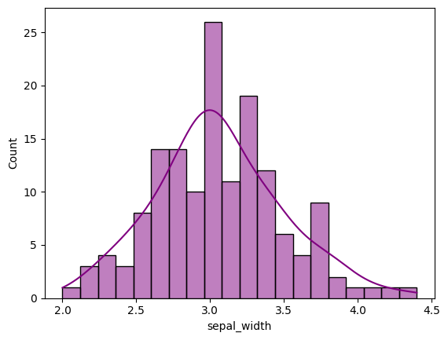
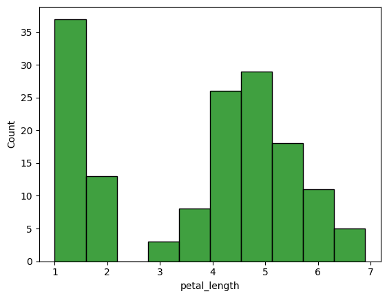
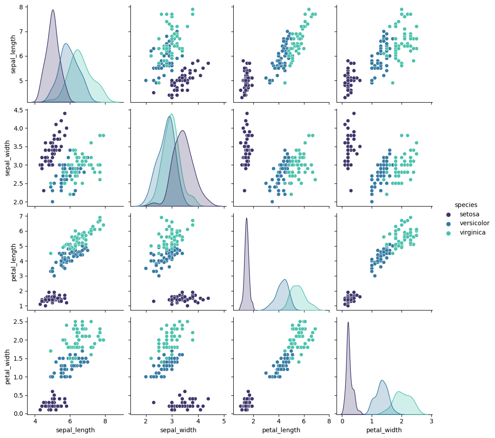
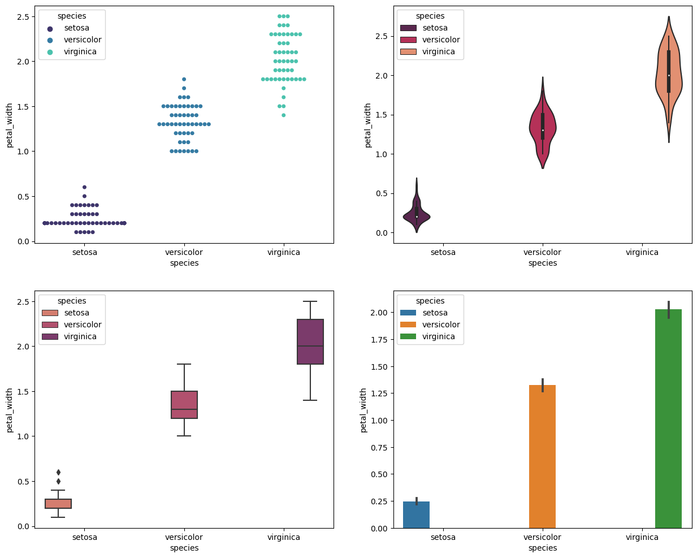

## Test yourself SOLUTIONS

1. Open a Juptyr notebook and save your work there.
 Don't forget to import your modules! 
```
import numpy as np
import pandas as pd
import seaborn as sns
import matplotlib as plt
```

2. Load the iris dataset. HINT: it is in the seaborn package. `iris = ???.load_dataset("iris")`.

```
iris = sns.load_dataset("iris")
```

3. Look at it and make a distribution plot for one of the variables. 

```
display(iris)  # displays the data as a table
print(iris.columns) # prints out the column names
### Index(['sepal_length', 'sepal_width', 'petal_length', 'petal_width',
###       'species'],
###      dtype='object') 
```


```
# Let's plot the sepal width
sns.histplot(iris['sepal_width'],kde=True,bins=20, color="purple")
# or petal length
sns.histplot(iris['petal_length'],bins=10, color="green")
```





4. Do a pairplot between all variables for the iris dataset.
As in the tut, we use pairplot. We can also select a color palette, and the column to colour it by (hue). 
```
sns.pairplot(iris, palette="mako", hue="species")
```




5. Plot a variable in the iris dataset with the four different plot types, as above. 

```
import matplotlib.pyplot as pltt
fig ,ax = pltt.subplots(figsize=(15,12), ncols=2,nrows=2)
sns.swarmplot(data=iris,x='species',y='petal_width',ax=ax[0,0],hue='species', palette="mako")
sns.violinplot(data=iris,x='species',y='petal_width',ax=ax[0,1],hue='species', palette="rocket")
sns.boxplot(data=iris,x='species',y='petal_width',ax=ax[1,0],hue='species', palette="flare")
sns.barplot(data=iris,x='species',y='petal_width',ax=ax[1,1],hue='species')
pltt.show()

```



