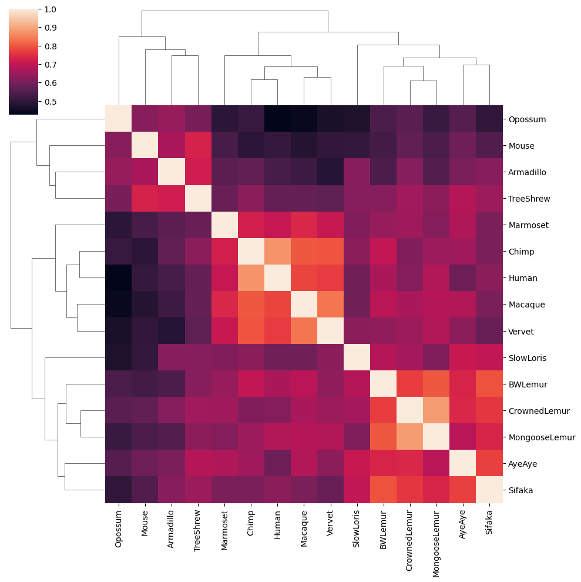

## Test yourself SOLUTIONS 
(A) python solution: 

```
import numpy as np
import pandas as pd
import seaborn as sns
import scipy
import matplotlib.pyplot as plt
```

Read in file and extract columns:
```
df_express = pd.read_csv("primateRNAseq/Gene.expression.data/Normalized.expression.data.txt", sep="\t")
genes = df_express[['Gene']]
samples = df_express.columns[33:94]
df_exprs_sub = df_express.iloc[:,33:94]
```

Get mean expression values per species
```
samples_dict = {}
i = 0 
for sample in samples:
    a,b = (sample.split('_'))
    if a not in samples_dict.keys():
        samples_dict[a] = []
        samples_dict[a].append(i)
    else:
        samples_dict[a].append(i)
    i += 1


df_mean = pd.DataFrame(columns = samples_dict.keys())
for sample in samples_dict.keys():
    temp = samples_dict[sample]
    df_mean.loc[:,sample] = df_exprs_sub.iloc[:,temp].apply(np.nanmean, axis=1)
```


Find species with least amount of data and drop it from data frame 
```
imax={}
for sample in samples_dict.keys():
    i = (df_mean[sample].isna().sum() ) 
    imax[i] = sample

filt_species = imax[max(imax.keys())]

df_mean = df_mean.drop(filt_species, axis=1)
```

Find genes with expression in at least 6 species and filter data frame: 
```
filt_genes = df_mean.isna().sum(axis=1) > 5 
df_mean_sub = df_mean.loc[filt_genes,:]
```

Calculate correlations and plot
```
samples_cor = df_mean_sub.corr(method="spearman")
sns.clustermap(samples_cor)
```


